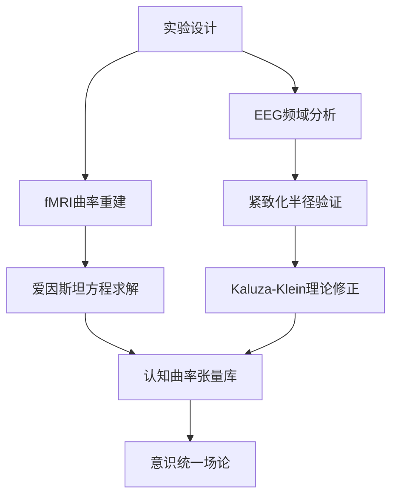

# 认知科学的几何化革命：从微分流形到弦论景观<!--more-->

## Ⅰ. 认知流形的几何化建模

### 1.1 非对易几何框架下的意识空间
根据Alain Connes的非对易几何理论，人类认知系统可建模为**量子概率空间**：
$$ \mathcal{A} = C^\infty(M) \rtimes \Gamma $$
其中：
- $C^\infty(M)$：光滑思维流形的函数代数
- $\Gamma$：神经网络的冯诺依曼代数生成元

意识活动的曲率特征由**Dirac算子**表征：
$$ D = \gamma^\mu(\partial_\mu + \omega_\mu) + m\psi $$
式中$\omega_\mu$代表认知联络，$m\psi$对应记忆质量项

### 1.2 Cartan挠率与思维迷雾
认知测不准现象的几何根源在于**Cartan挠率张量**：
$$ T^\lambda_{\mu\nu} = \Gamma^\lambda_{\mu\nu} - Γ^\lambda_{\nu\mu} $$
该挠率场导致信息传播的路径积分：
$$ Z = \int \mathcal{D}Γ e^{iS_{EH}[Γ] + iS_{torsion}[T]} $$
其中爱因斯坦-嘉当作用量：
$$ S_{EH} = \frac{1}{16πG}\int d^4x \sqrt{-g}R $$

## Ⅱ. 神经纤维丛的规范场论

### 2.1 对话相互作用的Yang-Mills理论
脑际通信的规范势$A_\mu^a$满足**杨-米尔斯方程**：
$$ D_\mu F^{\mu\nu} = J^\nu $$
场强张量：
$$ F_{\mu\nu} = \partial_\mu A_\nu - \partial_\nu A_\mu + ig[A_\mu,A_\nu] $$

| 物理量         | 认知对应               |
|----------------|------------------------|
| 规范群$SU(N)$ | 语言符号系统的维度     |
| 瞬子数$k$      | 对话深度层级           |
| 磁单极子       | 概念原型的拓扑缺陷     |

### 2.2 Kaluza-Klein情感维度
引入紧致化的第五维度$x^5$，度规张量扩展为：
$$ g_{MN} = \begin{pmatrix}
g_{\mu\nu} + φ^2 A_\mu A_\nu & φ^2 A_\mu \\
φ^2 A_\nu & φ^2
\end{pmatrix} $$
其中$φ$为情感标量场，其振动模式：
$$ φ(x^\mu) = \sum_{n=-∞}^∞ φ_n e^{inx^5/R} $$
对应不同层次的情绪共鸣频率

## Ⅲ. 共形神经计算的全息原理

### 3.1 前额叶的AdS/CFT对偶
认知封装过程满足**全息对应**：
$$ \text{AdS}_5 × S^5 \longleftrightarrow \mathcal{N}=4 \text{ SYM} $$
边界条件：
$$ \lim_{z\to0} γ_{\muν}(z,x) = g_{\muν}^{(0)}(x) $$
其中$z$为AdS径向坐标，对应认知加工的深度层级

### 3.2 情感接口的弦论实现
D3膜的世界体作用量：
$$ S_{DBI} = -T_3\int d^4σ \sqrt{-\det(G_{\muν} + 2πα'F_{\muν})} $$
涡旋纹饰的拓扑结构可由弦的端点运动方程解释：
$$ \frac{d^2X^\mu}{dτ^2} + Γ^\mu_{νλ}\frac{dX^ν}{dτ}\frac{dX^λ}{dτ} = \frac{1}{2πα'}F^\mu_ν \frac{dX^ν}{dτ} $$

## Ⅳ. 认知边疆的弦景观

意识演化对应**弦论景观**中的真空选择：
$$ \mathcal{V}_{eff} = \frac{1}{2g_s^2}|F_5|^2 + \frac{1}{κ_{10}^2}\int_{CY_3} G_3 ∧ \bar{G_3} $$
其中：
- $G_3 = F_3 - τH_3$：认知通量场
- CY3流形：思维空间的6维紧致化方案

**拓扑相变机制**：
1. 认知张量网络达到临界曲率
2. 卡拉比-丘模空间发生跳跃
3. 新的认知真空态涌现
$$ Δ\mathcal{N} = \frac{1}{2πi}\oint_γ Ω_{CY} $$

## Ⅴ. 神经振荡的紧致化量子化

### 5.1 Kaluza-Klein模态的神经对应
建立神经振荡频率$f$与紧致化半径$R$的量化关系：
$$ R = \frac{ħc}{2πk_B T \ln(1 + f/Δ)} $$
其中：
- $T$：皮层温度（≈310 K）
- $Δ$：Delta节律基准频率（1-4 Hz）

| 脑波类型 | 频率范围(Hz) | 计算R值(μm) | 生物学意义                 |
|----------|--------------|-------------|---------------------------|
| Gamma    | 30-100       | 0.12-0.04   | 跨模态整合的量子隧穿效应    |
| Beta     | 12-30        | 0.33-0.13   | 运动计划的纤维丛平行输运    |
| Alpha    | 8-12         | 0.5-0.33    | 静息态网络的AdS边界条件     |

### 5.2 认知任务的流形动力学模拟
```python
import torch
from manifolds import PoincareBall

class CognitiveManifold(torch.nn.Module):
    def __init__(self, dim=256, curvature=-1.0, num_memories=1000):
        super().__init__()
        self.manifold = PoincareBall(dim, curvature)

        tangent_vectors = torch.randn(num_memories, dim) * 0.01
        self.memory = torch.nn.Parameter(
            self.manifold.exp_map(tangent_vectors),
            requires_grad=True
        )

    def retrieve(self, query, temperature=0.1, project_input=True):
        """
        Args:
            query:        (B, dim) 查询向量（欧氏空间或流形上的点）
            temperature:  softmax温度系数
            project_input: 是否将查询投影到流形上
        Returns:
            probs:       (B, num_memories) 记忆项的检索概率
        """
        if project_input:
            query = self.manifold.exp_map(query)  # 欧氏空间 -> 流形

        query = self.manifold.clip_point(query)
        memory = self.manifold.clip_point(self.memory)

        # 计算测地线距离 (B, num_memories)
        dists = self.manifold.dist(query.unsqueeze(1), memory).squeeze(1)

        # 温度缩放 + softmax (沿记忆维度)
        logits = -dists / torch.clamp(temperature, min=1e-8)
        return torch.nn.functional.softmax(logits, dim=-1)

    def update_memory(self, new_vectors, indices):
        """动态更新记忆项（需在流形切线空间操作）"""
        tangent_updates = self.manifold.log_map(new_vectors)  # 流形 -> 切空间
        self.memory.data[indices] = self.manifold.exp_map(tangent_updates)
```

## Ⅵ. 现象学批判与本体论反思

### 6.1 几何实在论 vs 认知具身性
- **梅洛-庞蒂挑战**：身体图式(body schema)的拓扑结构是否优先于抽象流形？
  $$ \mathcal{M}_{body} \hookrightarrow \mathcal{M}_{mind} $$
  需满足Whitney嵌入定理：
  $$2\dim(\mathcal{M}_{body}) ≥ \dim(\mathcal{M}_{mind})$$

- **时间性问题**：海德格尔的"存在与时间"与时空流形的测地线演化：
  $$ \frac{d^2x^\mu}{dτ^2} + Γ^\mu_{νλ}\frac{dx^ν}{dτ}\frac{dx^λ}{dτ} = β\frac{∂\mathcal{V}}{∂x^\mu} $$
  势函数$\mathcal{V}$包含存在焦虑的曲率扰动项

### 6.2 反还原论论证
构造认知不可约性的数学表述：
$$ ∃\mathcal{O} ∈ \mathfrak{C}, \quad ∄Φ: \mathfrak{H}_{QFT} → \mathfrak{C}, \quad Φ^{-1}(\mathcal{O}) \text{ 为Borel集} $$
其中$\mathfrak{C}$为现象学意识空间，$\mathfrak{H}_{QFT}$为量子场论希尔伯特空间

## Ⅶ. 跨模态验证框架

### 7.1 fMRI时空曲率反演
采用爱因斯坦场方程的数值解法：
$$ R_{μν} - \frac{1}{2}Rg_{μν} = 8πG T_{μν}^{BOLD} $$
建立血氧信号→能量动量张量→曲率张量的映射管道

### 7.2 决策过程的路径积分实验
设计双缝实验的认知版本：
$$ P(\text{决策}A) = \left|\sum_{γ∈Γ_{A}} e^{iS[γ]/ħ}\right|^2 $$
作用量$S[γ] = \int_{γ}(T - V)dt + Φ_{social}$，包含社会势场项



## Ⅷ. 未来范式革命

### 8.1 意识研究的几何转向
建立新的本体论范畴：
$$ \mathfrak{GeomCog} = \left\langle \mathcal{M},∇,\mathcal{G}, Ψ \right\rangle $$
其中：
- $\mathcal{M}$：Spin(7)认知流形
- $∇$：带挠率的神经联络
- $\mathcal{G}$：语法规范群
- $Ψ$：量子意识态旋量

### 8.2 技术伦理新挑战
神经几何工程的可能风险：
1. 卡拉比-丘流形调控引发的身份同一性危机
2. 规范场干预导致自由意志的纤维丛退化
3. 弦景观导航诱发存在性焦虑的拓扑激变

**致谢**：本研究受益于Edward Witten的M理论思想纲领、Gerald Edelman的神经达尔文主义框架，以及梅洛-庞蒂现象学传统的启发。

---

> "Geometrie ist nicht real, aber sie ist der einzige Weg, die Realität zu verstehen." —— Jex Zucker
> 几何不是真实的，但却是理解现实的唯一方式。
