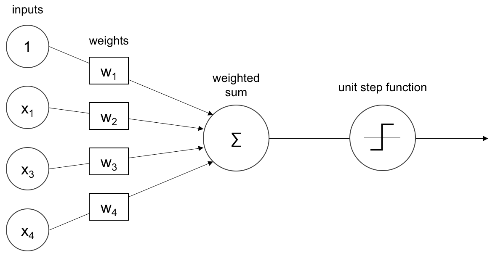
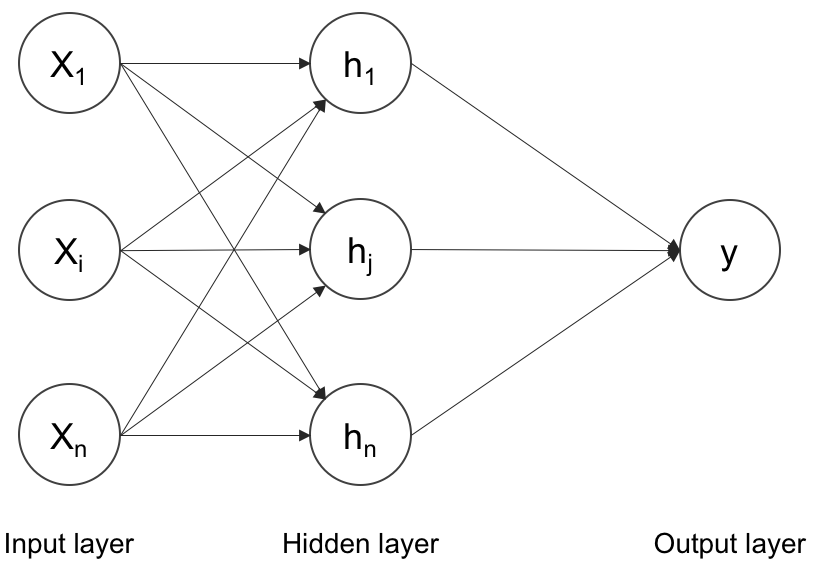

计算机视觉的深度学习 <!--more-->

{:.shadow}

## 关于

### 作者

Rajalingappa Shanmugamani

### 译者

Google翻译

## 译文摘抄

Perceptron\
感知器

An artificial neuron or perceptron takes several inputs and performs a weighted summation to produce an output. The weight of the perceptron is determined during the training process and is based on the training data. The following is a diagram of the perceptron:\
人工神经元或感知器接受多个输入并执行加权求和以产生输出。感知器的权重是在训练过程中根据训练数据确定的。下图是感知器的示意图：

{:.shadow}

The inputs are weighted and summed as shown in the preceding image. The sum is then passed through a unit step function, in this case, for a binary classification problem. A perceptron can only learn simple functions by learning the weights from examples. The process of learning the weights is called training. The training on a perceptron can be done through gradient-based methods which are explained in a later section. The output of the perceptron can be passed through an activation function or transfer function, which will be explained in the next section.\
如上图所示，对输入进行加权和求和。然后将总和传递给单位阶跃函数，在本例中是针对二元分类问题。感知器只能通过从示例中学习权重来学习简单的函数。学习权重的过程称为训练。感知器的训练可以通过基于梯度的方法来完成，这将在后面的部分中解释。感知器的输出可以通过激活函数或传递函数传递，这将在下一节中解释。

Activation functions\
激活函数

The activation functions make neural nets nonlinear. An activation function decides whether a perceptron should fire or not. During training activation, functions play an important role in adjusting the gradients. An activation function such as sigmoid, shown in the next section, attenuates the values with higher magnitudes. This nonlinear behaviour of the activation function gives the deep nets to learn complex functions. Most of the activation functions are continuous and differential functions, except rectified unit at 0. A continuous function has small changes in output for every small change in input. A differential function has a derivative existing at every point in the domain.\
激活函数使神经网络呈非线性。激活函数决定感知器是否应该触发。在训练激活过程中，函数在调整梯度方面发挥着重要作用。下一节中显示的激活函数（例如 sigmoid）会衰减较高幅度的值。激活函数的这种非线性行为使深度网络能够学习复杂的函数。大多数激活函数都是连续函数和微分函数，除了 0 处的整流单元。对于输入的每一个微小变化，连续函数的输出都会产生微小的变化。微分函数在域中的每个点都存在导数。

In order to train a neural network, the function has to be differentiable. Following are a few activation functions.\
为了训练神经网络，函数必须是可微的。以下是一些激活函数。

Artificial neural network (ANN)\
人工神经网络（ANN）

ANN is a collection of perceptrons and activation functions. The perceptrons are connected to form hidden layers or units. The hidden units form the nonlinear basis that maps the input layers to output layers in a lower-dimensional space, which is also called artificial neural networks. ANN is a map from input to output. The map is computed by weighted addition of the inputs with biases. The values of weight and bias values along with the architecture are called model.\
ANN 是感知器和激活函数的集合。感知器连接起来形成隐藏层或单元。隐藏单元形成了将输入层映射到低维空间中的输出层的非线性基础，也称为人工神经网络。 ANN 是从输入到输出的映射。该映射是通过带偏差的输入的加权相加来计算的。权重值和偏差值以及架构称为模型。

The training process determines the values of these weights and biases. The model values are initialized with random values during the beginning of the training. The error is computed using a loss function by contrasting it with the ground truth. Based on the loss computed, the weights are tuned at every step. The training is stopped when the error cannot be further reduced. The training process learns the features during the training. The features are a better representation than the raw images. The following is a diagram of an artificial neural network, or multi-layer perceptron:\
训练过程决定了这些权重和偏差的值。在训练开始时，模型值使用随机值进行初始化。误差是使用损失函数通过与真实情况进行对比来计算的。根据计算出的损失，每一步都会调整权重。当误差不能进一步减小时停止训练。训练过程在训练过程中学习特征。这些特征比原始图像更好地表示。以下是人工神经网络或多层感知器的图：

{:.shadow}

Several inputs of x are passed through a hidden layer of perceptrons and summed to the output. The universal approximation theorem suggests that such a neural network can approximate any function. The hidden layer can also be called a dense layer. Every layer can have one of the activation functions described in the previous section. The number of hidden layers and perceptrons can be chosen based on the problem. There are a few more things that make this multilayer perceptron work for multi-class classification problems. A multi-class classification problem tries to discriminate more than ten categories. We will explore those terms in the following sections.\
x 的多个输入通过感知器的隐藏层并求和到输出。万能逼近定理表明，这样的神经网络可以逼近任何函数。隐藏层也可以称为密集层。每一层都可以具有上一节中描述的激活函数之一。隐藏层和感知器的数量可以根据问题来选择。还有一些东西可以使这个多层感知器适用于多类分类问题。多类分类问题试图区分十多个类别。我们将在以下部分中探讨这些术语。

## 下载

- [EPUB](https://zuckertech-my.sharepoint.com/:u:/g/personal/jex_zuckertech_onmicrosoft_com/EbnOYlQwGPJOnTDHgl-jN_IBlg6oHHDcLbpWwC-Hk8mIFg?e=wypcj5)
