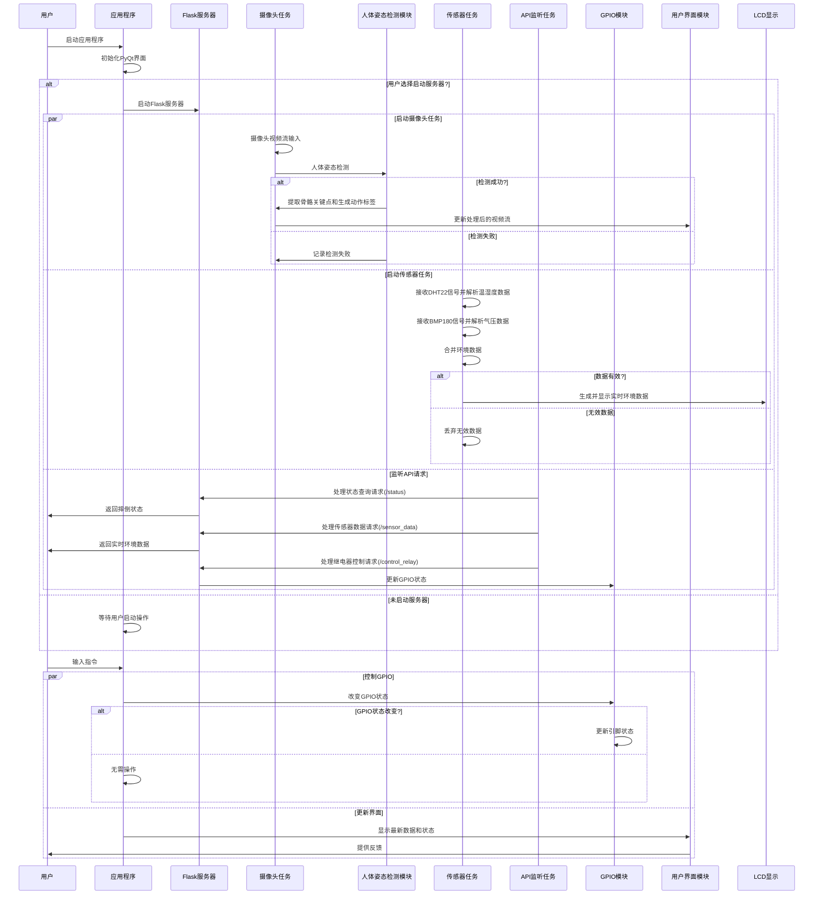

Hello World! <!--more-->

### Try the Mathjax

Equation

$$
1 + 1 = 2
$$

$$
e^{i \pi} + 1 = 0
\label{eq:math_1}
$$

$$
i \frac{\partial \psi}{\partial t} = \hat{H} \psi
$$

$$
\begin{align*}
y = y(x,t) &= A e^{i\theta} \\
&= A (\cos \theta + i \sin \theta) \\
&= A (\cos(kx - \omega t) + i \sin(kx - \omega t)) \\
&= A\cos(kx - \omega t) + i A\sin(kx - \omega t)  \\
&= A\cos \Big(\frac{2\pi}{\lambda}x - \frac{2\pi v}{\lambda} t \Big) + i A\sin \Big(\frac{2\pi}{\lambda}x - \frac{2\pi v}{\lambda} t \Big)  \\
&= A\cos \frac{2\pi}{\lambda} (x - v t) + i A\sin \frac{2\pi}{\lambda} (x - v t)
\end{align*}
$$

### Try the code highlight

```python
print "Hello World!"
```

### Try the footnote

`Hello World`[^1]

### Try Mermaid



[^1]: This is a footnote.
